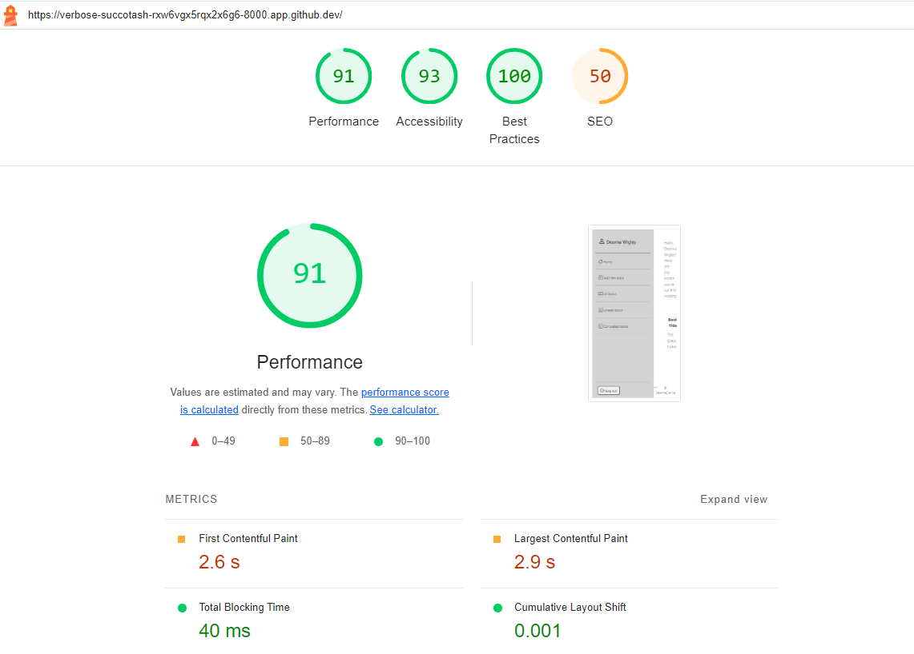
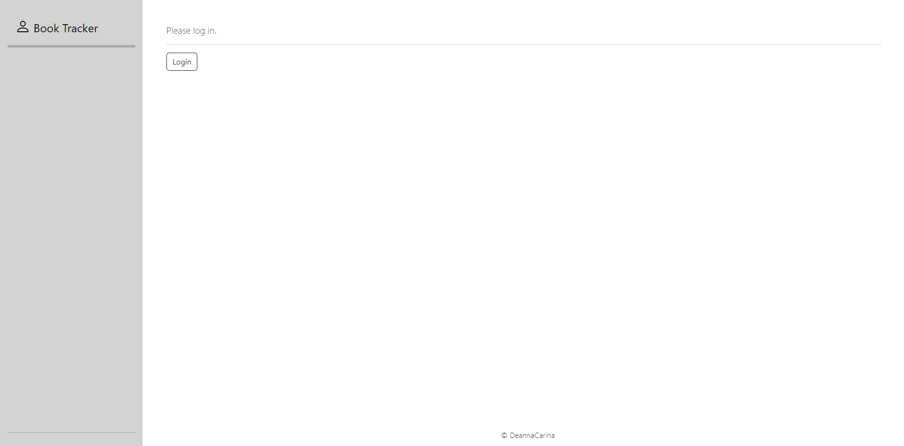
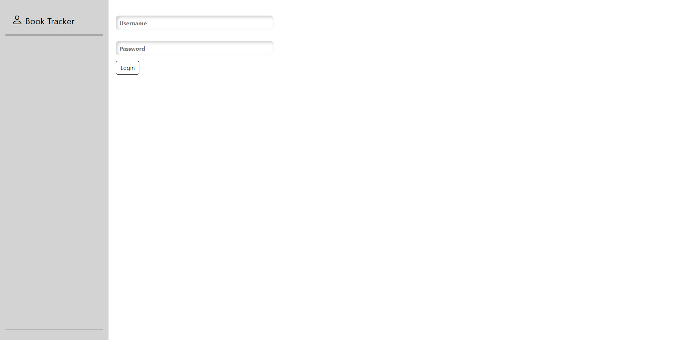
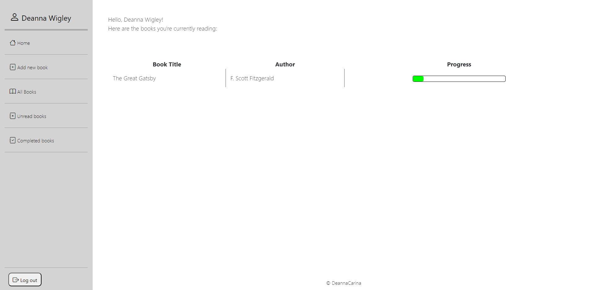
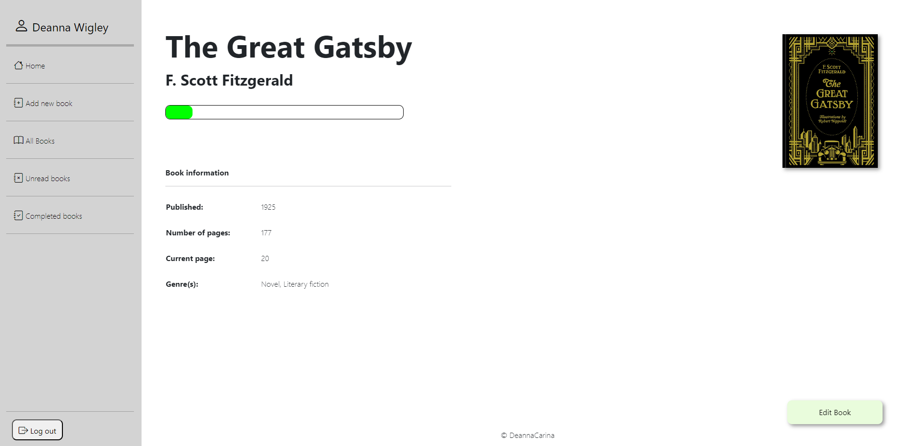

<a href="https://elht-rbs.herokuapp.com/"><h1>Book Tracker</h1></a>

## Introduction

Book Tracker application

This is is a small Django application for tracking books that you have read. You are able to add books to the database, edit the details, and track the page number that you are on.

### Performance Testing
Below is the report generated from lighthouse via Chrome DevTools. 
 

## Deployment/Dowload

### Forking the GitHub repo
If you want to make changes to the repo without affecting it, you can make a copy of it by 'Forking' it. This will make sure that the original repo remains unchanged.
<ol>
    <li>Log in to your GitHub account</li>
    <li>Navigate to the repository <a href="https://github.com/DeannaCarina/BookTracker"><strong>HERE</strong></a></li>
    <li>Select the 'Fork' button in the top right corner of the page (under your account image)</li>
    <li>The repo has now been copied into your own repos and you can work on it in your chosen IDE</li>
    <li>If you have any suggestions to make regards to the code to make the site better, you can put in a pull request</li>
    <li>In the console, run: pip install -r requirements.txt</li>
    <li>If you want to create a web-app from the repo please see "Project Deployment"</li>
</ol>

### Cloning the repo with GitPod
<ol>
    <li>Log in to your GitHub account</li>
    <li>Navigate to the Repository <a href="https://github.com/DeannaCarina/BookTracker"><strong>HERE</strong></a></li>
    <li>Select the 'Code' button above the file list on the right had side</li>
    <li>Ensure HTTPS is selected and click the clipboard on the right of the URL to copy it</li>
    <li>Open a new workspace in GitPod</li>
    <li>In the bash terminal type 'git clone [repo url]'</li>
    <li>Press enter - the IDE will clone and download the repo</li>
    <li>In the console, run: pip install -r requirements.txt</li>
</ol>
  
### Github Desktop
<ol>
    <li>Log in to your GitHub account</li>
    <li>Navigate to the Repository <a href="https://github.com/DeannaCarina/BookTracker"><strong>HERE</strong></a></li>
    <li>Select the 'Code' button above the file list on the right had side</li>
    <li>Select 'Open with GitHub Desktop'</li>
    <li>If you haven't already installed GitHub desktop application - you will need to follow the relevant steps to do this</li>
    <li>The repo will then be copied locally onto your machine</li>
    <li>In the console, run: pip install -r requirements.txt</li>
</ol>

### Download and extract the zip directly from GitHub
<ol>
    <li>Log in to your GitHub account</li>
    <li>Navigate to the Repository <a href="https://github.com/DeannaCarina/BookTracker"><strong>HERE</strong></a></li>
    <li>Select the 'Code' button above the file list on the right had side</li>
    <li>Select 'Download Zip'</li>
    <li>Once you have the Zip downloaded, open it with your preferred file decompression software</li>
    <li>You can then drag and drop the files from the folder into your chosen IDE or view/edit them on your local machine</li>
    <li>In the console, run: pip install -r requirements.txt</li>
</ol>

### Project Deployment
You are able to use a service such as GCP or AWS to host this application, or you can run it locally from your file explorer in a browser, or from within an IDE such as Github codespaces/Gitpod using the usual Django/Python command: python manage.py runserver.
  
## Credits
### Code
All code used in this project was written and made with the help of Django's documentation.

## Screenshots

